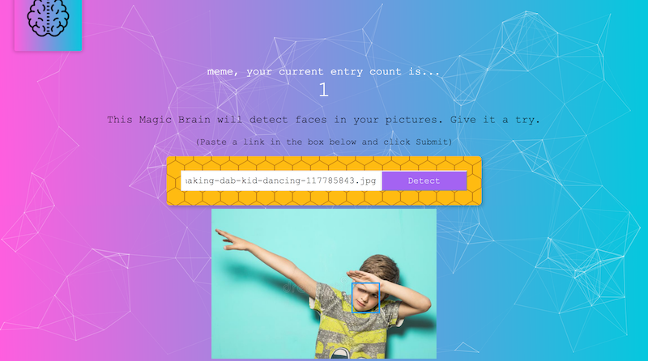

# Box For Your Face

This React app lets you send an image link, and it returns the image with a box around a face it recognises. It uses the Clarifai API to recognise faces.

# Installation

To run this, you need Node.js (and npm, but this is now included). You can download it [here](https://nodejs.org/en/).
You can also install the backend on your system if you want to run everything locally - its repo is [here](https://github.com/oisinq/box-for-your-face-api).

With Node downloaded, you can install the webapp as follows:
  
  `$ git clone https://github.com/oisinq/box-for-your-face.git`
  `$ cd box-for-your-face`
  `$ npm install`

Installation might take a bit as it installs all dependencies.

To run, type:

  `$ npm start`
  
  
### Have fun!
